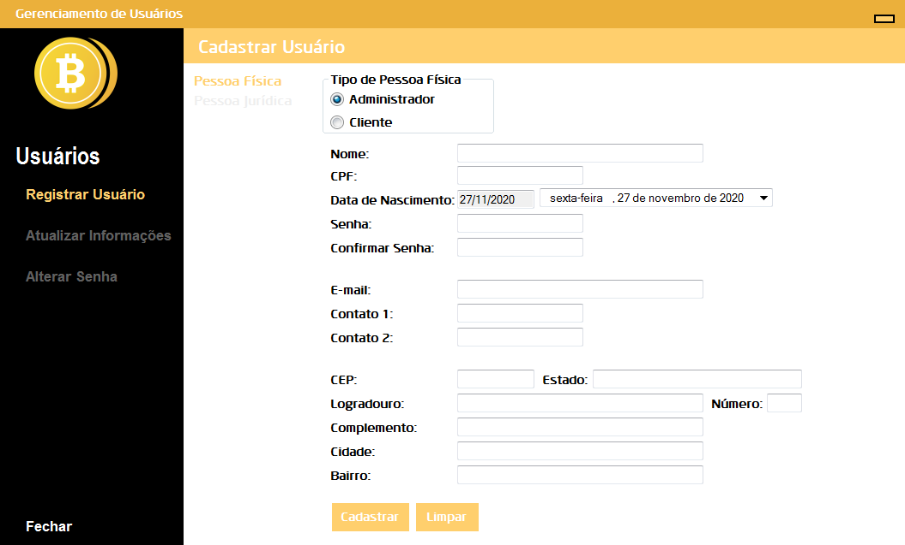
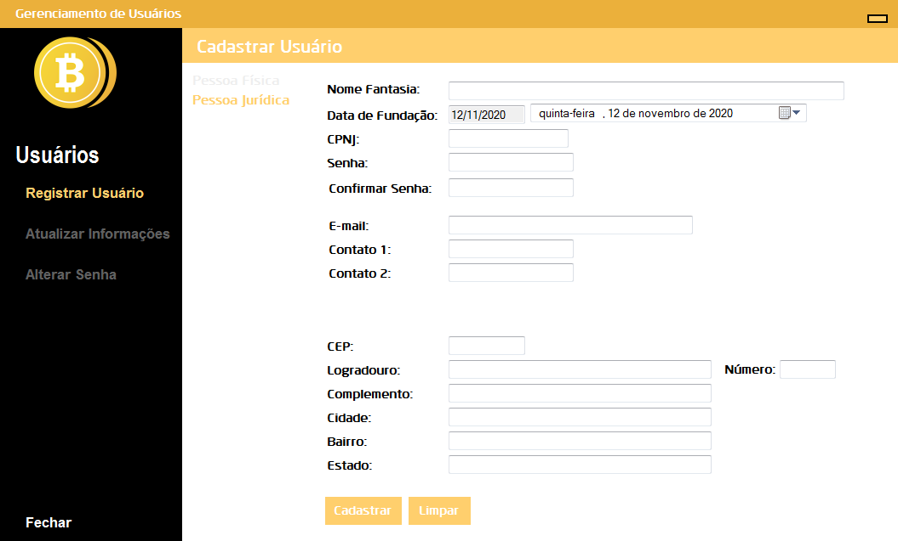
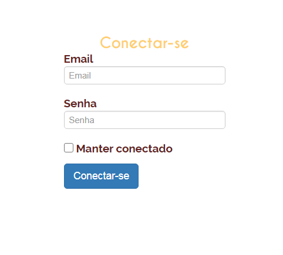
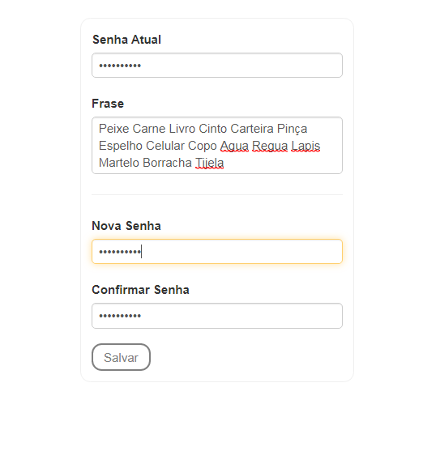
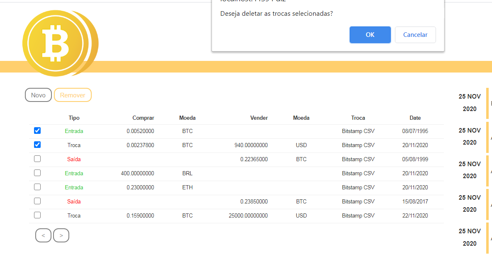

# PIM - GERENCIADOR DE ENTRADAS E SAÍDAS - BLOCKCHAIN

O SISTEMA A SEGUIR FOI DESENVOLVIDO COMO PROJETO INTEGRADO MULTIDISCIPLINAR, NO CURSO DE ANÁLISE E DESENVOLVIMENTO DE SISTEMAS, COM O OBJETIVO DE DISPONIBILIZAR UM GERENCIADOR DE ENTRADA E SAÍDA DE VALORES PESSOAIS DO MERCADO DE CRIPTOMOEDAS.
O SISTEMA CONSTA COM ALGUMAS FUNCIONALIDADES, DESDE A SEGURANÇA DA CONTA PESSOAL DO USUÁRIO, ATÉ MESMO DE UMA TABELA CONTENDO OS DADOS DE CONTABILIDADE E CONTROLE DO CLIENTE.
SEGUE IMAGENS COM EXPLICAÇÕES.

<h3>Cadastro de Clientes e Administradores</h3>

O cadastro do cliente é importante para que o mesmo possa ter acesso ao sistema via site. O cliente pode ser cadastrado como Pessoa Juíridica ou Física.
Pode-se também cadastrar um administrador, podendo o mesmo, assim, ter acesso as áreas mais privadas do sistema.

<h3>Login</h3>

Como parte do sistema Web, temos realização do login é importante para que os dados do usuário permaneçam salvos em sua conta.

<h3>Alterar Senha</h3>

O cliente pode alterar a sua senha caso o mesmo já tenha configurado anteriormente a frase secreta, importante para a segurança da conta do mesmo.

<h3>Alterar ou criar Frase Secreta</h3>

A criação da frase secreta é necessária para que o cliente consiga alterar a sua senha no sistema.

<h3>Tabela de Gerenciamento</h3>

Na tabela de gerenciamento de dados o cliente pode visualizar todas as transações que já realizou e cadastrou, sendo elas do tipo Saída, Entrada e Troca.
Ao lado da Tabela, é possível verificar a linha do tempo do cliente, onde estão cadastradas todas as transações que já foram realizadas, organizadas por data.

<h3>Nova Transação</h3>

Para adicionar uma nova transação, o cliente deve colocar os dados necessários do tipo de transação desejada.
- Se for Troca, é necessário colocar os dados de entrada e saída;
- Se for Entrada, é necessário colocar os dados de Compra;
- Se for Saída, é necessário colocar os dados de Venda.

O comentário é opcional.

<h3>Deletar Transação</h3>

Uma ou mais transações podem ser deletadas. Basta selecionar as mesmas, clicar em Remover, e confirmar na caixa de diálogo.

